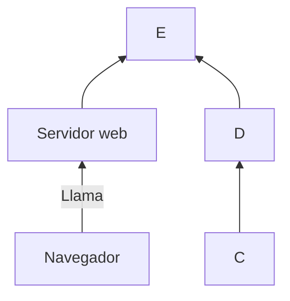

# Guía de Markdown 📘

Markdown es un lenguaje de marcado ligero que se utiliza para formatear texto de forma sencilla. Es muy popular en la escritura de documentación, blogs y contenido web debido a su simplicidad y legibilidad.

---

## 1. Markdown Básico 📝

### **Encabezados**
Usa \`#\` para crear encabezados:

```markdown
# Encabezado de nivel 1
## Encabezado de nivel 2
### Encabezado de nivel 3
```

### **Estilos de texto** ✍️
**Negrita**  
*Cursiva*  
**_Negrita y cursiva_**

### **Listas ordenadas y desordenadas** 🔢
1. Elemento 1
2. Elemento 2
3. Elemento 3

- Elemento A
- Elemento B
- Elemento C

### **Enlaces a paginas web** 🌐
[Visita Google](https://www.google.com)  

### **Icono en la pagina web** 🖼️


### **Tablas** 🗂️
| Encabezado 1 | Encabezado 2 | Encabezado 3 |  
|--------------|--------------|--------------|  
| Fila 1 Col 1 | Fila 1 Col 2 | Fila 1 Col 3 |  
| Fila 2 Col 1 | Fila 2 Col 2 | Fila 2 Col 3 |  

---

## 2. Markdown de Gráficos 📊

### **Diagramas con Mermaid** 🖋️


### **Citas** 💬
> \"La simplicidad es la máxima sofisticación.\"  
> — Leonardo da Vinci

### **Video de youtube** 📹



### **Botones que acceden a otras web** 🔘

Este boton accede a la web accede a la web

---

## 3. Markdown Extendido 🚀

### **Código en Python** 💻
```python
def hola_mundo():
    print("¡Hola, mundo!")
```

### **Tareas pendientes** ✅
- [x] Aprender Markdown básico
- [ ] Explorar gráficos en Markdown
- [ ] Usar Markdown extendido" > markdown.md
